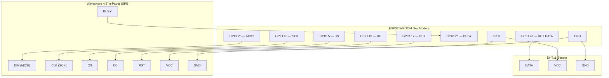

# ESP32 Weather Station

A low-power indoor/outdoor weather station built on the ESP32 WROOM. It reads indoor conditions from a DHT11 sensor, fetches outdoor weather and a 3-day forecast from the [Open-Meteo](https://open-meteo.com/) API (no API key required), and renders the full layout onto a Waveshare 4.2" e-paper display. The device wakes every 10 minutes, completes its update cycle in under 15 seconds, then returns to deep sleep.

---

## Table of Contents

1. [Hardware Bill of Materials](#hardware-bill-of-materials)
2. [Wiring Diagram](#wiring-diagram)
3. [Pin Reference](#pin-reference)
4. [Software Setup](#software-setup)
5. [Configuration](#configuration)
6. [Build & Flash](#build--flash)
7. [Operation](#operation)
8. [Display Layout](#display-layout)
9. [Project Structure](#project-structure)
10. [Performance Targets](#performance-targets)
11. [Troubleshooting](#troubleshooting)

---

## Hardware Bill of Materials

| # | Component | Notes |
|---|-----------|-------|
| 1 | **ESP32 WROOM Dev Module** | Any standard 38-pin board |
| 2 | **Waveshare 4.2" e-Paper Display** | Rev 2.1, GDEW042T2, 400 × 300 px B/W |
| 3 | **DHT11 Temperature & Humidity Sensor** | 3-pin breakout or 4-pin module with pull-up |
| 4 | **10 kΩ resistor** | Pull-up on DHT11 DATA line (omit if using breakout with built-in resistor) |
| 5 | **Breadboard / PCB + jumper wires** | — |
| 6 | **5 V USB power supply** | Powers the ESP32 via its onboard regulator |

---

## Wiring Diagram

```
                        ┌──────────────────────────────────────────┐
                        │           ESP32 Dev Module               │
                        │                                          │
          ┌─── 3.3V ────┤ 3V3                               GPIO23 ├──── MOSI ────┐
          │  ┌── GND ───┤ GND                               GPIO18 ├──── SCK  ────┤
          │  │          │                                   GPIO 5 ├──── CS   ────┤
          │  │          │                                   GPIO16 ├──── DC   ────┤  Waveshare
          │  │          │                                   GPIO17 ├──── RST  ────┤  4.2" e-Paper
          │  │          │                                   GPIO25 ├──── BUSY ────┘  (SPI)
          │  │          │                                          │
          │  │          │                                   GPIO26 ├──── DATA ────┐
          │  │          │                                          │              │  DHT11
          └──┼──────────┤ 3V3  ◄────────────────────────── VCC   │◄─────────────┤
             └──────────┤ GND  ◄────────────────────────── GND   │              │
                        └──────────────────────────────────────────┘             │
                                                                    10kΩ to 3.3V ┘
                                                                    (pull-up, if needed)
```

### Schematic (Mermaid)



---

## Pin Reference

### e-Paper Display — SPI

| Display Pin | ESP32 GPIO | Notes |
|-------------|-----------|-------|
| DIN (MOSI)  | **23**    | SPI data |
| CLK (SCK)   | **18**    | SPI clock |
| CS          | **5**     | Chip select (active LOW) |
| DC          | **16**    | Data / Command select |
| RST         | **17**    | Hardware reset (active LOW) |
| BUSY        | **25**    | High while display is refreshing |
| VCC         | 3.3 V     | — |
| GND         | GND       | — |

### DHT11 Sensor

| Sensor Pin | ESP32 GPIO | Notes |
|-----------|-----------|-------|
| DATA      | **26**    | Add 10 kΩ pull-up to 3.3 V if using bare IC |
| VCC       | 3.3 V     | — |
| GND       | GND       | — |

> **Note:** All signal lines run at 3.3 V logic. The ESP32's onboard 3.3 V LDO supplies both peripherals; total current draw at peak (Wi-Fi TX + SPI) stays well within its 600 mA rating.

---

## Software Setup

### Prerequisites

- [PlatformIO](https://platformio.org/) (VS Code extension or CLI)
- USB driver for your ESP32 board (CP210x or CH340, depending on board variant)

### Library Dependencies

Managed automatically by PlatformIO via `platformio.ini`:

| Library | Version | Purpose |
|---------|---------|---------|
| `zinggjm/GxEPD2` | ^1.6.0 | e-Paper driver (GxEPD2_420 / GDEW042T2) |
| `bblanchon/ArduinoJson` | ^7.0.0 | JSON parsing (v7 `JsonDocument`) |
| `adafruit/DHT sensor library` | ^1.4.6 | DHT11 driver |
| `adafruit/Adafruit Unified Sensor` | ^1.1.14 | Sensor abstraction |
| `HTTPClient` | (bundled) | HTTP requests |
| `WiFiClientSecure` | (bundled) | HTTPS (TLS with `setInsecure()`) |
| `Preferences` | (bundled) | NVS storage |

---

## Configuration

### Wi-Fi Credentials — `secrets.h`

Create `secrets.h` in the **project root** (it is excluded from version control via `.gitignore`):

```cpp
// secrets.h
#pragma once

#define WIFI_SSID     "your-network-name"
#define WIFI_PASSWORD "your-network-password"
```

### Location & Time Zone — `src/config.h`

Edit these constants if you are not in Crestwood, KY:

```cpp
static constexpr double LOCATION_LAT  =  38.3242;
static constexpr double LOCATION_LON  = -85.4725;
static constexpr char   LOCATION_TZ[] = "America/New_York";
static constexpr char   LOCATION_NAME[] = "Crestwood, KY";

static constexpr long GMT_OFFSET_SEC  = -18000;   // UTC-5 (EST)
static constexpr int  DAYLIGHT_OFFSET = 3600;      // +1 h during EDT
```

> **Remember** to also update the latitude/longitude in `OPENMETEO_URL` inside `config.h` to match.

### Sleep Interval — `src/config.h`

```cpp
static constexpr uint64_t SLEEP_DURATION_US = 10ULL * 60ULL * 1000000ULL;  // 10 minutes
```

---

## Build & Flash

```bash
# Build only
pio run

# Build and upload
pio run --target upload

# Monitor serial output
pio device monitor --baud 115200
```

Or use the **PlatformIO: Build / Upload** buttons in VS Code.

> **Stack size:** The Arduino loop task stack is set to **16 KB** (`-DARDUINO_LOOP_STACK_SIZE=16384` in `platformio.ini`) to accommodate GxEPD2 page-buffered rendering alongside the `WeatherSnapshot` struct and font rendering.

---

## Operation

### Wake Sequence (every 10 minutes)

```
Power-on / RTC wakeup
        │
        ▼
  Init e-paper hardware (before Wi-Fi to avoid heap fragmentation)
        │
        ▼
  Connect Wi-Fi  ──(fail)──► render cached data → deep sleep
        │
        ▼
  NTP sync (once per calendar day)
        │
        ▼
  Read DHT11 (up to 3 retries, 2 s apart)
        │
        ▼
  HTTPS GET Open-Meteo API → getString() → deserializeJson()
        │
        ▼
  Write NVS trend record (once per calendar day, if sensor + API both OK)
        │
        ▼
  Render framebuffer → full e-paper refresh
        │
        ▼
  Deep sleep 10 min
```

### Offline Behaviour

If the Wi-Fi connection or API call fails, the device will:
- Display the last successfully fetched weather data (cached in RTC memory)
- Show "! Offline – cached data" warning and "Offline" in the top bar
- Still display live indoor sensor readings
- Continue the normal sleep / wake cycle

### RTC-Retained State

Across deep-sleep cycles, the following are preserved in RTC memory:
- Last successful `CurrentConditions` and `ForecastDay[3]`
- Timestamp of last successful API call
- Day-of-year of last NTP sync and last NVS trend write
- Wake counter

### NVS Trend Storage

Up to **365 daily records** are stored in NVS flash using a circular buffer. Each record (18 bytes) contains:
- Day index (days since epoch)
- Indoor temperature & humidity
- Outdoor temperature
- Barometric pressure

The **30 most recent** records are rendered as a dual-line trend graph at the bottom of the display (indoor = solid, outdoor = dotted).

---

## Display Layout

The display is a 400 × 300 px monochrome e-paper panel rendered with GxEPD2 page-buffered drawing and Adafruit GFX (FreeSans) fonts.

```
┌────────────────────────────────────────────────────────────────┐  y=0
│  22:05       Sun Feb 22                            Online     │  Top bar (22 px)
├──────────┬──────────────────────────┬─────────────────────────┤  y=22
│ INDOOR   │                          │  WIND                   │
│ 22.5°C   │      -4.7°              │  22 km/h                │
│ 32% RH   │   Partly Cloudy         │─────────────────────────│  Main panels
│──────────│      ⛅ (48×48 icon)     │  PRESSURE               │  (133 px)
│          │                          │  1018 hPa               │
│          │                          │─────────────────────────│
│          │                          │  HUMIDITY               │
│          │                          │  74%                    │
├──────────┴──────────────────────────┴─────────────────────────┤  y=155
│    TODAY         TMRW          +2 DAY                         │
│  4 / -1°C     6 / 0°C        8 / 2°C                         │  Forecast (62 px)
│  Rain 20%     Rain 60%       Rain 10%                         │
├───────────────────────────────────────────────────────────────┤  y=217
│  Rise 07:12     Set 17:48     Wax Cresc                       │  Astronomy (20 px)
├───────────────────────────────────────────────────────────────┤  y=237
│  30d  IN ───  OUT · · ·   (auto-scaled line graph)            │  Trend graph (63 px)
└───────────────────────────────────────────────────────────────┘  y=300
```

**Panel widths:** Left 100 px · Centre 200 px · Right 100 px

### Fonts

| Zone | Font | Size |
|------|------|------|
| Top bar | FreeSansBold | 9 pt |
| Indoor label | FreeSans | 9 pt |
| Indoor temp | FreeSansBold | 12 pt |
| Outdoor temp | FreeSansBold | 18 pt |
| Weather desc | FreeSans | 9 pt |
| Right panel labels | FreeSans | 9 pt |
| Right panel values | FreeSansBold | 9 pt |
| Forecast day labels | FreeSansBold | 9 pt |
| Forecast data | FreeSans | 9 pt |
| Astronomy bar | FreeSans | 9 pt |
| Trend graph label | Built-in 6×8 | 1× |

### Weather Icons

48 × 48 px icons drawn with Adafruit GFX primitives (circles, lines, rectangles) — no bitmaps. Mapped from WMO weather codes:

| WMO Code | Icon | Description |
|----------|------|-------------|
| 0 | Sun | Clear sky |
| 1–3 | Sun + cloud | Partly cloudy |
| 45–48 | Dashed lines | Fog |
| 51–67 | Cloud + drops | Rain |
| 71–77 | Cloud + flakes | Snow |
| 80–82 | Outline cloud + drops | Showers |
| 95–99 | Cloud + bolt | Thunderstorm |
| Other | Circle + ? | Unknown |

### Moon Phase

Calculated locally from a synodic-period algorithm (reference new moon: 2000-01-06 18:14 UTC). Labels: New, Wax Cresc, 1stQtr, Wax Gibb, Full, Wan Gibb, LastQtr, Wan Cresc.

---

## Project Structure

```
WeatherStation/
├── platformio.ini              # Build config, libs, stack size (16 KB)
├── secrets.h                   # Wi-Fi credentials (git-ignored)
├── README.md                   # This file
├── ESP32 Weather Station – Product Requirements.md
└── src/
    ├── main.cpp                # Wake/sleep orchestration, RTC-retained state
    ├── config.h                # Pins, API URL, layout geometry, NVS keys
    ├── data_model.h            # Shared structs (CurrentConditions, ForecastDay,
    │                           #   DailyTrend, SensorReading, WeatherSnapshot)
    ├── wifi_manager/           # Wi-Fi connect/disconnect with configurable timeout
    │   ├── wifi_manager.h
    │   └── wifi_manager.cpp
    ├── ntp_service/            # SNTP sync (once per calendar day via RTC check)
    │   ├── ntp_service.h
    │   └── ntp_service.cpp
    ├── openmeteo_client/       # HTTPS GET → getString() → ArduinoJson v7 parsing
    │   ├── openmeteo_client.h  #   Moon phase calculated locally (not from API)
    │   └── openmeteo_client.cpp
    ├── sensor_service/         # DHT11 read with retry logic (up to 3 attempts)
    │   ├── sensor_service.h
    │   └── sensor_service.cpp
    ├── trend_storage/          # NVS circular buffer (365 records, daily writes)
    │   ├── trend_storage.h
    │   └── trend_storage.cpp
    ├── display_renderer/       # GxEPD2 page-buffered layout, GFX fonts & icons
    │   ├── display_renderer.h
    │   ├── display_renderer.cpp
    │   └── icon_renderer.h     # 48×48 vector icons drawn via GFX primitives
    └── power_manager/          # Deep sleep entry
        ├── power_manager.h
        └── power_manager.cpp
```

---

## Performance Targets

| Metric | Target |
|--------|--------|
| Wi-Fi connect | < 4 s |
| API call + parse | < 3 s |
| Render + refresh | < 4 s |
| **Total active time** | **≤ 15 s** |
| Sleep current | ~10 µA (ESP32 deep sleep) |
| Wake interval | 10 minutes |
| RAM usage | ~19% (62 KB / 328 KB) |
| Flash usage | ~49% (953 KB / 1966 KB) |

---

## Weather API

**Provider:** [Open-Meteo](https://open-meteo.com/) — no API key required.

**Endpoint (configured in `src/config.h`):**
```
https://api.open-meteo.com/v1/forecast
  ?latitude=38.3242&longitude=-85.4725
  &current=temperature_2m,relative_humidity_2m,pressure_msl,wind_speed_10m,weather_code
  &daily=weather_code,temperature_2m_max,temperature_2m_min,
         precipitation_probability_max,sunrise,sunset
  &timezone=auto
  &forecast_days=3
```

A single HTTPS request returns current conditions and a 3-day forecast (~3 KB payload), minimising Wi-Fi on-time per cycle. Moon phase is computed locally rather than requested from the API.

---

## Troubleshooting

| Symptom | Cause | Fix |
|---------|-------|-----|
| `JSON parse error: InvalidInput` | Chunked transfer encoding on HTTPS stream | Fixed: uses `getString()` instead of stream parsing |
| `stack overflow in task loopTask` | Default 8 KB stack too small for GxEPD2 + fonts | Fixed: stack set to 16 KB in `platformio.ini` |
| Display renders upside-down | Wrong `setRotation()` value | Set `display.setRotation(0)` for connector-at-top mounting |
| Text overlapping / 2× scale | Icon renderer leaking `setTextSize(2)` | Fixed: `drawUnknown()` now resets to `setTextSize(1)` |
| DHT reads `NaN` | Sensor needs 2 s warm-up after power-on | Built-in: 2 s delay on first read, 3 retries |
| Wi-Fi fails | Weak signal or wrong credentials | Check `secrets.h`; timeout is 20 s (configurable) |
