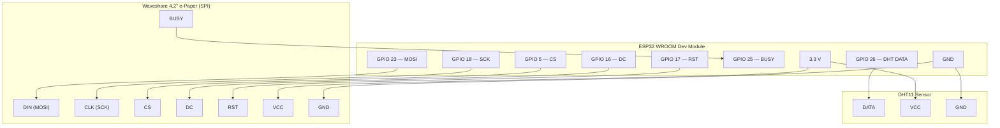

# ESP32 Weather Station

A low-power indoor/outdoor weather station built on the ESP32 WROOM. It reads indoor conditions from a DHT11 sensor, fetches outdoor weather and a 3-day forecast from the Open-Meteo API, and renders the full layout onto a Waveshare 4.2" e-paper display. The device wakes every 10 minutes, completes its update cycle in under 15 seconds, then returns to deep sleep.

---

## Table of Contents

1. [Hardware Bill of Materials](#hardware-bill-of-materials)
2. [Wiring Diagram](#wiring-diagram)
3. [Pin Reference](#pin-reference)
4. [Software Setup](#software-setup)
5. [Configuration](#configuration)
6. [Build & Flash](#build--flash)
7. [Operation](#operation)
8. [Display Layout](#display-layout)
9. [Project Structure](#project-structure)
10. [Performance Targets](#performance-targets)

---

## Hardware Bill of Materials

| # | Component | Notes |
|---|-----------|-------|
| 1 | **ESP32 WROOM Dev Module** | Any standard 38-pin board |
| 2 | **Waveshare 4.2" e-Paper Display** | Rev 2.1, GDEW042T2, 400 × 300 px B/W |
| 3 | **DHT11 Temperature & Humidity Sensor** | 3-pin breakout or 4-pin module with pull-up |
| 4 | **10 kΩ resistor** | Pull-up on DHT11 DATA line (omit if using breakout with built-in resistor) |
| 5 | **Breadboard / PCB + jumper wires** | — |
| 6 | **5 V USB power supply** | Powers the ESP32 via its onboard regulator |

---

## Wiring Diagram

```
                        ┌──────────────────────────────────────────┐
                        │           ESP32 Dev Module               │
                        │                                          │
          ┌─── 3.3V ────┤ 3V3                               GPIO23 ├──── MOSI ────┐
          │  ┌── GND ───┤ GND                               GPIO18 ├──── SCK  ────┤
          │  │          │                                   GPIO 5 ├──── CS   ────┤
          │  │          │                                   GPIO16 ├──── DC   ────┤  Waveshare
          │  │          │                                   GPIO17 ├──── RST  ────┤  4.2" e-Paper
          │  │          │                                   GPIO25 ├──── BUSY ────┘  (SPI)
          │  │          │                                          │
          │  │          │                                   GPIO26 ├──── DATA ────┐
          │  │          │                                          │              │  DHT11
          └──┼──────────┤ 3V3  ◄────────────────────────── VCC   │◄─────────────┤
             └──────────┤ GND  ◄────────────────────────── GND   │              │
                        └──────────────────────────────────────────┘             │
                                                                    10kΩ to 3.3V ┘
                                                                    (pull-up, if needed)
```

### Schematic (Mermaid)



---

## Pin Reference

### e-Paper Display — SPI

| Display Pin | ESP32 GPIO | Notes |
|-------------|-----------|-------|
| DIN (MOSI)  | **23**    | SPI data |
| CLK (SCK)   | **18**    | SPI clock |
| CS          | **5**     | Chip select (active LOW) |
| DC          | **16**    | Data / Command select |
| RST         | **17**    | Hardware reset (active LOW) |
| BUSY        | **25**    | High while display is refreshing |
| VCC         | 3.3 V     | — |
| GND         | GND       | — |

### DHT11 Sensor

| Sensor Pin | ESP32 GPIO | Notes |
|-----------|-----------|-------|
| DATA      | **26**    | Add 10 kΩ pull-up to 3.3 V if using bare IC |
| VCC       | 3.3 V     | — |
| GND       | GND       | — |

> **Note:** All signal lines run at 3.3 V logic. The ESP32's onboard 3.3 V LDO supplies both peripherals; total current draw at peak (Wi-Fi TX + SPI) stays well within its 600 mA rating.

---

## Software Setup

### Prerequisites

- [PlatformIO](https://platformio.org/) (VS Code extension or CLI)
- USB driver for your ESP32 board (CP210x or CH340, depending on board variant)

### Library Dependencies

Managed automatically by PlatformIO via `platformio.ini`:

| Library | Version | Purpose |
|---------|---------|---------|
| `zinggjm/GxEPD2` | ^1.6.0 | e-Paper driver |
| `bblanchon/ArduinoJson` | ^7.0.0 | JSON parsing |
| `adafruit/DHT sensor library` | ^1.4.6 | DHT11 driver |
| `adafruit/Adafruit Unified Sensor` | ^1.1.14 | Sensor abstraction |
| `HTTPClient` | (bundled) | HTTP requests |
| `WiFiClientSecure` | (bundled) | HTTPS |
| `Preferences` | (bundled) | NVS storage |

---

## Configuration

### Wi-Fi Credentials — `secrets.h`

Create `secrets.h` in the **project root** (it is excluded from version control):

```cpp
// secrets.h
#pragma once

#define WIFI_SSID     "your-network-name"
#define WIFI_PASSWORD "your-network-password"
```

### Location & Time Zone — `src/config.h`

Edit these constants if you are not in Crestwood, KY:

```cpp
static constexpr double LOCATION_LAT  =  38.3242;
static constexpr double LOCATION_LON  = -85.4725;
static constexpr char   LOCATION_TZ[] = "America/New_York";
static constexpr char   LOCATION_NAME[] = "Crestwood, KY";

static constexpr long GMT_OFFSET_SEC  = -18000;   // UTC-5 (EST)
static constexpr int  DAYLIGHT_OFFSET = 3600;      // +1 h during EDT
```

### Sleep Interval — `src/config.h`

```cpp
static constexpr uint64_t SLEEP_DURATION_US = 10ULL * 60ULL * 1000000ULL;  // 10 minutes
```

---

## Build & Flash

```bash
# Build only
pio run

# Build and upload
pio run --target upload

# Monitor serial output
pio device monitor --baud 115200
```

Or use the **PlatformIO: Build / Upload** buttons in VS Code.

---

## Operation

### Wake Sequence (every 10 minutes)

```
Power-on / RTC wakeup
        │
        ▼
  Connect Wi-Fi  ──(fail)──► use cached data
        │
        ▼
  NTP sync (once per day)
        │
        ▼
  Read DHT11 (3 retries)
        │
        ▼
  GET Open-Meteo API
        │
        ▼
  Parse JSON (8 KB heap buffer)
        │
        ▼
  Write NVS trend record (once per day)
        │
        ▼
  Render framebuffer
        │
        ▼
  Full e-paper refresh
        │
        ▼
  Deep sleep 10 min
```

### Offline Behaviour

If the Wi-Fi connection or API call fails, the device will:
- Display the last successfully fetched weather data
- Show an offline warning icon
- Still display live indoor sensor readings
- Continue the normal sleep / wake cycle

### NVS Trend Storage

Up to **365 daily records** are stored in NVS flash using a circular buffer. Each record contains:
- Day index (days since epoch)
- Indoor temperature & humidity
- Outdoor temperature
- Pressure

The 30 most recent records are rendered as a line graph on the display.

---

## Display Layout

```
┌────────────────────────────────────────────────────────────────┐  ▲
│  HH:MM   Mon 22 Feb 2026                          WiFi ✓       │  │ Top bar (24 px)
├──────────────┬─────────────────────────┬──────────────────────┤  │
│  INDOOR      │                         │  Wind    12 km/h     │  │
│  22.5°C      │       -3.1°C            │  Pressure 1013 hPa   │  │ Main panels
│  Humidity    │        ☁️               │  Rain     20%        │  │ (176 px)
│  45%         │                         │                      │  │
├──────────────┴─────────────────────────┴──────────────────────┤  │
│   Mon              Tue              Wed                        │  │ Forecast row
│   ⛅  4 / -1  20%  🌧  6 / 0   60%  ☀️  8 / 2  10%          │  │ (58 px)
├───────────────────────────────────────────────────────────────┤  │
│  🌅 07:12   🌇 17:48   🌙 Waxing Crescent  ░░▓▓▓░░          │  ▼ Bottom bar (40 px)
└───────────────────────────────────────────────────────────────┘
  └──────────── 30-day temperature trend graph overlaid ────────┘
```

**Panel widths:** Left 110 px · Centre 180 px · Right 110 px  
**Total resolution:** 400 × 300 px, 1-bit monochrome

---

## Project Structure

```
WeatherStation/
├── platformio.ini              # Build configuration & library dependencies
├── secrets.h                   # Wi-Fi credentials (not committed)
├── README.md                   # This file
└── src/
    ├── main.cpp                # Wake/sleep orchestration
    ├── config.h                # Pin assignments, constants, layout geometry
    ├── data_model.h            # Shared structs (CurrentConditions, ForecastDay, …)
    ├── wifi_manager/           # Wi-Fi connect/disconnect with timeout
    ├── ntp_service/            # SNTP sync (once per day via RTC check)
    ├── openmeteo_client/       # HTTPS GET + ArduinoJson parsing
    ├── sensor_service/         # DHT11 read with retry logic
    ├── trend_storage/          # NVS circular buffer (365 records)
    ├── display_renderer/       # GxEPD2 layout, fonts, icon blitting
    └── power_manager/          # Deep sleep entry, wake-cause detection
```

---

## Performance Targets

| Metric | Target |
|--------|--------|
| Wi-Fi connect | < 4 s |
| API call + parse | < 3 s |
| Render | < 2 s |
| Display refresh | < 4 s |
| **Total active time** | **≤ 15 s** |
| Sleep current | ~10 µA (ESP32 deep sleep) |
| Wake interval | 10 minutes |

---

## Weather API

**Provider:** [Open-Meteo](https://open-meteo.com/) — no API key required.

**Endpoint:**
```
https://api.open-meteo.com/v1/forecast
  ?latitude=38.3242&longitude=-85.4725
  &current=temperature_2m,relative_humidity_2m,pressure_msl,wind_speed_10m,weather_code
  &daily=temperature_2m_max,temperature_2m_min,precipitation_probability_max,
         sunrise,sunset,moonrise,moonset,moon_phase
  &timezone=auto
  &forecast_days=3
```

A single request returns current conditions, a 3-day forecast, and astronomical data, minimising Wi-Fi on-time per cycle.
